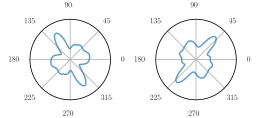

## EquivAnIA: A Spectral Method for Rotation-Equivariant Anisotropic Image Analysis<br><sub>Official PyTorch implementation</sub>

[](https://arxiv.org/abs/2603.11294)
[](https://github.com/jscanvic/Anisotropic-Analysis)

<p align="center"></p>

<p align="center">Angular profiles of rotated copies of the same image</p>

**EquivAnIA: A Spectral Method for Rotation-Equivariant Anisotropic Image Analysis**<br>
[Jérémy Scanvic](https://jeremyscanvic.com), [Nils Laurent](https://nils-laurent.github.io/)

Abstract: *Anisotropic image analysis is ubiquitous in medical and scientific imaging, and while the literature on the subject is extensive, the robustness to numerical rotations of numerous methods remains to be studied. Indeed, the principal directions and angular profile of a rotated image are often expected to rotate accordingly. In this work, we propose a new spectral method for the anisotropic analysis of images (EquivAnIA) using two established directional filters, namely cake wavelets, and ridge filters. We show that it is robust to numerical rotations throughout extensive experiments on synthetic and real-world images containing geometric structures or textures, and we also apply it successfully for a task of angular image registration.*

### Experiments

The repository contains the code to reproduce the experiments in addition to the code for the method which is made available in the directory `equivania`. Please find detailed instructions below for the experiments on synthetic and real-world images.

#### Setup

To setup the Python environment, clone the repository and install the dependencies listed in `pyproject.toml`:
```bash
git clone https://github.com/jscanvic/Anisotropic-Analysis EquivAnIA
cd EquivAnIA
pip install .
```

#### Synthetic images

The experiments on synthetic images can be reproduced using the following commands.

- Table 1 can be reproduced using:
```
python valid_statistical.py
python valid_statistical_read.py
```
The first command runs the main computations and writes them to disk while the second reads and analyze them.

- Figure 3 can be reproduced using:
```bash
python fig_synthesis_analysis.py
```

- Figure 4 can be reproduced using:
```bash
python fig_synthesis.py
```

#### Real-world images

The experiments on the real-world CT scan and bark texture can be run using the following commands:

```bash
python real_world.py -c configs/ct_scan.yaml
python real_world.py -c configs/bark.yaml
```

### Acknowledgment

The CT scan used in the experiments is from the [LIDC IDRI](https://www.cancerimagingarchive.net/collection/lidc-idri/) dataset.

The bark texture is from the texture classification dataset made available [here](https://github.com/abin24/Textures-Dataset).

### Citation

Please consider citing this work if you find it useful in your research:

```
@article{scanvic2026equivania,
  title={EquivAnIA: A Spectral Method for Rotation-Equivariant Anisotropic Image Analysis},
  author={Scanvic, J{\'e}r{\'e}my and Laurent, Nils},
  journal={arXiv preprint arXiv:2603.11294},
  year={2026}
}
```
